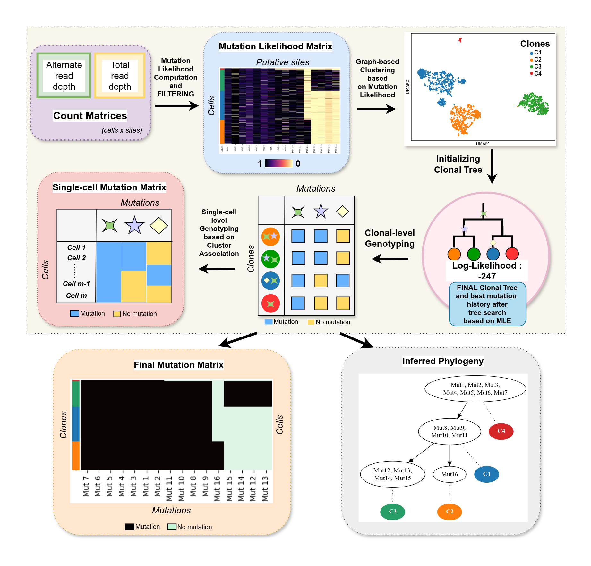

# PHALCON

PHALCON is a scalable single-cell variant caller designed for high-throughput sequencing data. It is robust to common single-cell sequencing (SCS) errors and enables accurate mutation detection across large numbers of cells within practical runtimes.

