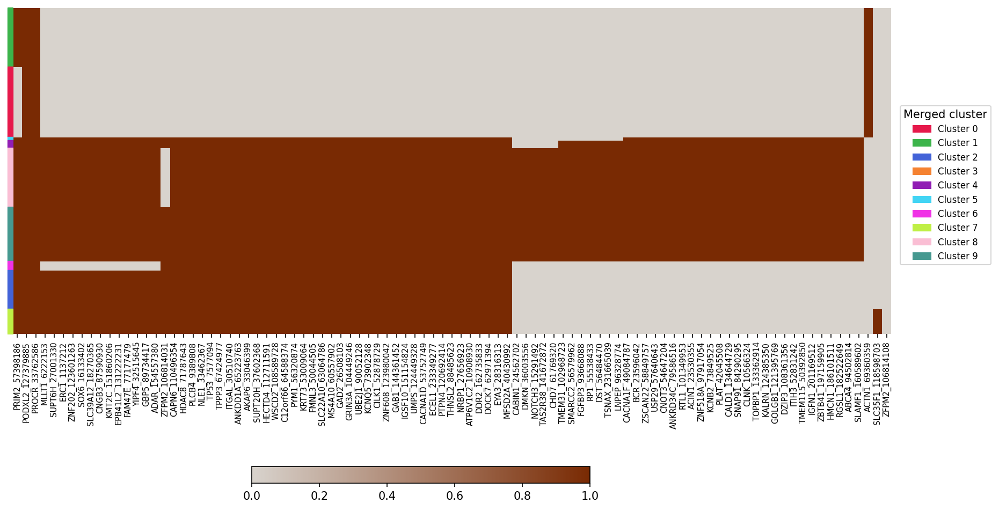
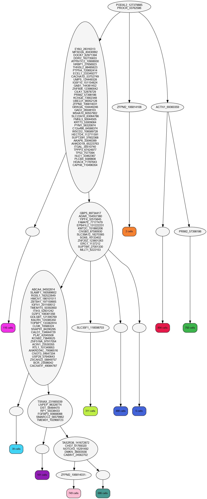

## TN4 tutorial

### Prepare the parameters
* `-D` : TN4
* `-i` : readCounts_MBTN4_nodups.tsv (Input read count file name , present in the folder [Count_file_and_gq_file](https://drive.google.com/drive/folders/14__kHyT4DfLZl_JTa-NJVHbDUGbbJ8Ze?usp=drive_link))
* `-g` : gq_file_TN4.tsv (Quality file name, present in the folder [Count_file_and_gq_file](https://drive.google.com/drive/folders/14__kHyT4DfLZl_JTa-NJVHbDUGbbJ8Ze?usp=drive_link))
* `-o` : TN4_ (Output prefix)


### Running PHALCON

 * The output obtained from MissioBio Tapestri pipeline is in the form of loom files. The loom file for TN4 is present in the folder [loom file](https://drive.google.com/drive/folders/1vW4XBpDR5H7cTjCcf_3dkokAOKc9Otcr?usp=drive_link).
* To convert the loom file in PHALCON-style input use the script ```loomToReadcount.py``` present in the same folder

<font color="red">Input</font> : Pass the readcount file, genotype quality file and the output prefix name.
Run the following command:
```python
python Algorithm_phalcon_indels.py -D TN4 -i readCounts_MBTN4_nodups.tsv -g gq_file_TN4.tsv -o TN4_
```
<font color="red">Output</font> : 
You will get the variants inferred by PHALCON in form of a VCF file.

Subset vcf output:
```
##fileformat=VCFv4.1
##source=OurAlgoOurAlgo v0.1.0
##FILTER=<ID=LowQual,Description="Low quality">
##INFO=<ID=DP,Number=1,Type=Integer,Description="Approximate read depth; some reads may have been filtered">
##FORMAT=<ID=AD,Number=.,Type=Integer,Description="Allelic depths for alt alleles">
##FORMAT=<ID=DP,Number=1,Type=Integer,Description="Approximate read depth (reads with MQ=255 or with bad mates are filtered)">
##FORMAT=<ID=GQ,Number=1,Type=Integer,Description="Genotype Quality">
##FORMAT=<ID=GT,Number=1,Type=String,Description="Genotype">
##FORMAT=<ID=PL,Number=G,Type=Integer,Description="Normalized, Phred-scaled likelihoods for genotypes as defined in the VCF specification">
#CHROM  POS     ID      REF     ALT     QUAL    FILTER  INFO    FORMAT  cell1   cell2   cell3   cell4   cell5   cell6   cell7   cell8   cell9   cell10  cell11  cell12  cell13  cell14  cell15  >
chr1    115258748       *       C       T       *       PASS    DP=809943       GT:AD:DP:GQ:PL  0/1:392:392:99  0/1:227:430:99  0/0:0:444:99    0/0:0:205:99    0/0:0:0:99      0/0:0:211:99    >
chr1    115258749       *       T       G       *       PASS    DP=805084       GT:AD:DP:GQ:PL  0/1:392:392:99  0/1:227:430:99  0/0:0:0:99      0/0:0:207:99    0/0:0:104:99    0/0:0:209:99    >
chr2    25463285        *       GCGGTAGAACTCAAA G       *       PASS    DP=188342       GT:AD:DP:GQ:PL  0/1:0:97:99     0/1:6:23:99     0/1:0:0:12      0/1:26:44:99    0/0:0:124:99    0/1:47:4>
chr2    25469085        *       CG      C       *       PASS    DP=216991       GT:AD:DP:GQ:PL  0/0:0:149:99    0/0:0:63:99     0/1:0:19:57     0/0:0:149:99    0/0:1:124:99    0/1:0:0:99      >
chr2    25469913        *       C       T       *       PASS    DP=128427       GT:AD:DP:GQ:PL  0/1:0:39:99     0/1:39:60:99    0/1:32:32:95    0/1:22:33:99    0/1:66:93:99    0/1:29:33:35    >
chr2    198266943       *       C       T       *       PASS    DP=689574       GT:AD:DP:GQ:PL  0/1:307:313:99  0/1:72:72:99    0/1:149:151:99  0/1:217:217:99  0/1:242:242:99  0/1:153:154:99  >
chr2    198267770       *       G       GAA     *       PASS    DP=257605       GT:AD:DP:GQ:PL  0/1:46:92:99    0/1:0:0:99      0/1:27:59:99    0/1:15:22:99    0/1:56:117:99   0/1:0:0:99      >
chr4    55592244        *       G       A       *       PASS    DP=266536       GT:AD:DP:GQ:PL  0/1:93:325:99   0/1:0:0:99      0/1:0:0:99      0/1:0:0:99      0/1:15:65:99    0/1:0:0:99      
```

### Post-processing using dbSNP

The post processing includes removing variants with no mutation across all cells and removing clonal variants present in the dbSNP database 📑 

*  The dbSNP.vcf is present at the link [dbSNP_database](https://drive.google.com/file/d/1yy30skLXLOd4jDniXLWgaEqqozATlCN0/view?usp=drive_link)


Follow the steps below to generate the final vcf file of post-processed variants:

*  Download the folder [post-processing](https://drive.google.com/drive/folders/1pEHDfl8mCl3LuR02_PLioJCtQRRQ97Xx?usp=drive_link) in your local system
*   Open termnal inside the folder and type ```jupyter-notebook```
* Open the notebook [Post-processing_AML-67-001.ipynb](https://drive.google.com/file/d/1Yt3M_x0wBndzOCs9wl16o0pzKw_LAxfu/view?usp=drive_link)
* Run ```dbsnp_for_aml_finite_sites.py```
* You will get a final list of variants in form of a vcf file in a file name ending with ```_post_processed_final.vcf```

**NOTE**: As input to the ```dbsnp_for_aml_finite_sites.py``` python file, you only need the vcf file you obtained after running PHALCON. 
If required, change the location of the vcf file accordingly. 

* Use ```-i``` to provide location of the input vcf file 
* Use ```-o``` to mention the name of the post processed vcf file

### Annotate variants

For variant annotation using ANNOVAR, the necessary files and scripts are present in the [annotating_variants](https://drive.google.com/drive/folders/1pfyQ7VWEw9cZKXe9RLwVetxKC4SY2vss?usp=drive_link) link. 


Use the following steps to annotate mutations:

*  Download the folder [annotating_variants](https://drive.google.com/drive/folders/1pfyQ7VWEw9cZKXe9RLwVetxKC4SY2vss?usp=drive_link) in your local system
*   Open termnal inside the folder and type ```jupyter-notebook```
* Open the notebook [Annotating_the_final_variants.ipynb](https://drive.google.com/file/d/1WBz1aBEFTjcZbZ4y6XOBEubgQwR3gvGk/view?usp=drive_link)
* Run ```run_annovar_for_annotating_final_variants.py```
* You will get an annotated files of the final variants

**NOTE**: As input to the ```run_annovar_for_annotating_final_variants.py``` python file, you only need the post-processed vcf file. 
If required, change the location of the vcf file accordingly. 

* Use ```-i``` to provide location of the post-processed input vcf file 
* Use ```-o``` to mention the output tag of the annotated files

### Visualization

The genotyped variants are shown in the form of a heatmap, and the chronological order of mutations is shown in the form of a phylogenetic tree.

The following files are needed to produce the final tree and genotypes (All of these files can be obtained by running the above pipelines):

* ```-d``` : Tag for the dataset (*OPTIONAL*)(*Acts as an identifier*)
* ```--cluster_labels_file``` : Inferred cluster labels (*Obtained as one of the files after running PHALCON*)
* ```--lklhd_file``` : Likelihood file containing mutation likelihood for each cell and variant (*Obtained as one of the files after running PHALCON*)
* ```--final_df_file``` : Likelihood file containing mutation likelihood for each cell and variant (*Obtained as one of the files after running PHALCON*)
* ```--genotype_config_file``` : Genotype configuration file (*Obtained as one of the files after running PHALCON*)
* ```--newick_file``` : Newick format file (*Obtained as one of the files after running PHALCON*)
* ```--vcf_file``` : Final post-processed VCF file (Post-processed final VCF file, refer to [Post-processing using dbSNP](#post-processing-using-dbsnp))
* ```--variant_function_file``` : Gene-annotated file of the post-processed VCF file, refer to [Annotate variants](#annotate-variants))

Run the following command (all the files used in the command can also be found in the [Input_for_visualisation](https://drive.google.com/drive/folders/1Y0UDlHPwAHSQaWybjpWQDzZHkqkEs4_h?usp=drive_link) folder for ease):

```python
python phalcon_visualization_pipeline.py -d TN4 --cluster_labels_file TN4_inferred_cluster_labels.txt --lklhd_file TN4_final_lklhds.tsv --final_df_file TN4_final_df.tsv --genotype_config_file TN4_Genotype_configuration.tsv --newick_file TN4_inferred_tree.nw --vcf_file TN4_post_processed_vcf.vcf --variant_function_file TN4_final.avinput.variant_function
```
You will obtain the following outputs:

* <font color="red">**Genotype heatmap**</font>:

The genotype heatmap shows the genotype profiles of each cell. There is a bar at the top which shows the cluster association of each cell.


* <font color="red">**UMAP**</font>:

The umap shows the clusters obtained by PHALCON on a 2-d plane.
<center>

</center>

* <font color="red">**Phylogenetic tree**</font>:

The reconstructed mutation history tree shows the order in which the mutations have appeared.


